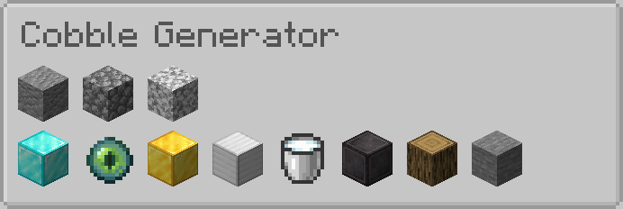
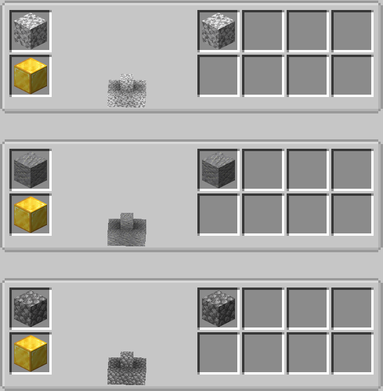

# Bonsai Trees 4 Configuration Guide

## Table of Contents

1. [Introduction](#introduction)
2. [Changes from Bonsai Trees 3](#changes-from-bonsai-trees-3)
3. [Auto-Generation](#auto-generation)
    1. [Pull-Requests / Using the game test framework](#pull-requests--using-the-game-test-framework)
    2. [In-Game](#in-game)
4. [Bonsais](#bonsais)
    1. [Basic Example](#basic-example)
    2. [Additional Properties](#additional-properties)
5. [Loot Tables](#loot-tables)
6. [Soil Types](#soil-types)
    1. [Built-in Soil Types](#built-in-soil-types)
    2. [Custom Soil Types](#custom-soil-types)
7. [Soils](#soils)
    1. [Blocks Soils](#block-soils)
    2. [Fluid Soils](#fluid-soils)
    3. [Item Soils](#item-soils)
8. Tree Models

## Introduction

This guide is aimed at pack developers who wish to configure Bonsai Trees 4 for their modpack.
If you just want to add support for the trees of a specific mod it is enough to read the
[Auto-Generation](#auto-generation) section and be somewhat familiar with data and resource
packs. If you want to customize the mod in more detail it is assumed that you have a basic
understanding of how to configure mods in Minecraft using JSON files.

### Data Maps

Since most of the customization is done through [Data Maps](https://docs.neoforged.net/docs/1.21.1/resources/server/datamaps/)
it is recommended that you have a basic understanding of how they work. The gist of it is that
they are a way to define custom data for items, blocks, entities and other registry objects.

### Data Packs

All customization for Bonsai Trees can and should be done using data and resource packs. This
allows for easy sharing of configurations and ensures that the mod stays fully data-driven.
But it also means that you need to be familiar with how to create and/or use data and resource
packs in Minecraft.

- The data pack is where all the configuration is done.
- The resource pack is only needed to make the bonsais look like the trees.

### Paths

The most common issue is finding the correct paths to place files in. The following list should
help you with that - assuming you are creating a cobble gen bonsai for the pack `cobblepot`:

```
project-root
└───datapacks
│   └───cobblepot
│       │   pack.mcmeta
│       │   pack.png
│       └───data
│           └───bonsaitrees4
│                └───bonsaitrees4
│                │   └───soiltype
│                │       └   vanilla_tiers.json
│                │
│                └───data_maps
│                │   └───block
|                │   │   └   soil.json
│                │   │
│                │   └───fluid
|                │   │   └   soil.json
│                │   │
│                │   └───item
|                │       │   bonsai.json
|                │       └   soil.json
|                │
│                └───loot_table
│                    └───bonsai
│                         └───cobblepot
│                             │   cobblestone_cluster.json
│                             │   andesite_cluster.json
│                             └   diorite_cluster.json
└───resourcepacks
    └───cobblepot
         │   pack.mcmeta
         │   pack.png
         └───assets
             └───bonsaitrees4
                  └───models
                      └───multiblock
                            └───cobblepot
                                │   cobblestone_cluster.json
                                │   andesite_cluster.json
                                └   diorite_cluster.json
```

## Changes from Bonsai Trees 3

Bonsai Trees 4 is a complete rewrite of the mod and as such we took the opportunity to make some
changes to the customization aspects of the mod.

The main changes are:

- Bonsai recipes have been removed in favor of Loot Tables.
- Soil recipes have been replaced with a more flexible [Datapack Registry](https://docs.neoforged.net/docs/1.21.1/concepts/registries#datapack-registries) based system.
- The multi block [Tree Models](#tree-models) are now actual minecraft models allowing for some fancy features.
- Each mod (or set of custom non tree bonsais, e.g. cobblegens) should ship as a separate data and resource pack.
  These can and will still be included in the main jar of the mod, but can now also be updated separately.
- The growth speed of bonsais is now fixed. Instead, bonsais can now produce a variable amount of items when they grow.
  The loot tables for the bonsais use the tool in the Bonsai Pot to generate the outcome. Enchantments and other tool
  properties are taken into account when generating the loot.

## Auto-Generation

Bonsai Trees 4 supports full and easy auto-generation of resource and data packs for mods that
use the vanilla tree grower system. This means that most mods should work out of the box with
no additional configuration needed.

The auto-generation takes care of creating:

- The models for the bonsais
- The data map entries for the bonsais
- The loot tables for the bonsais
- The pack meta-data and folder structure
- Zipped and ready to use data and resource packs

There are two ways to include support for a mod:

### Pull-Requests / Using the game test framework

This is the recommended way to add support for a mod as it includes the mod in the next Bonsai
Trees 4 release automatically. It requires you to edit some files and know how to create forks
and pull requests on GitHub.

The game test framework is a system that allows you to run tests in a short-lived server instance
of the game. It is (ab)used by Bonsai Trees 4 to generate the data and resource packs for all
loaded mods. Work has been done to ensure that most mods work out of the box with this system,
but there are some mods that require manual intervention and require opening an issue on the
Bonsai Trees 4 GitHub repository.

If we managed to set up everything correctly on GitHub it should be enough to create a pull
request with the mod added to the `dependencies` list in the `build.gradle` file. The rest should
be handled automatically.

#### Example

**Step 0**: Get the project name, project id and file id of the mod you want to add.
You can find this information on the CurseForge page of the mod. [Where?](curseforge_file_data.png)

**Step 1**: Fork the `1.21.1` branch of the [Bonsai Trees repository](https://github.com/davenonymous/BonsaiTrees)

**Step 2**: Edit the `build.gradle` file and add the mod to the `dependencies` list

```gradle
dependencies {
    ...

    // Only used for the data and resource pack generation
    runtimeOnly "curse.maven:biomes-o-plenty-220318:${biomesoplenty_fileid}"
    runtimeOnly "curse.maven:regions-unexplored-659110:${regionsunexplored_fileid}"

    // Add your mod here, e.g. for twilight forest:
    runtimeOnly "curse.maven:the-twilight-forest-227639:${twilightforest_fileid}"
    ...
}
```

**Step 3**: Edit the `gradle.properties` file and add the file ID for the mod to the bottom of the file

```ini
...
curios_fileid=6076118
titanium_fileid=5897690
geckolib_fileid=6027599

# Add the latest file id here, e.g. for twilight forest:
twilightforest_fileid=6070226
```

**Step 4**: Make sure the tree generation action has been executed after your changes. Maybe you need to
trigger the GitHub action manually. It should have created a new commit with the generated data and
resource packs.

**Step 5**: Create a pull request with your changes.

### In-Game

If you don't want to create a pull request or the mod you want to add is not available via Maven you
can use an in-game command to generate the data and resource packs for the mod you want to add.

If you want to automatically generate zip files for the packs or export them to a specific path you
can tweak some settings in the Pack Generation config available in the mod options or config file.

**Step 1**: Start a new superflat world with both mods (bonsai trees and yours) installed.

**Step 2**: Run the command `/bonsai generate-data-pack <modid>`, e.g. `/bonsai generate-data-pack twilightforest`.

**Step 3**: You can find the generated data and resource packs in your Minecraft instance folder
under `bonsai-generated/` or in the path you specified in the config.

**Step 4**: Add the generated data and resource packs to your mod pack or corresponding instance folders.
Make sure they are being loaded!

You can also specify `--all` as mod id to generate data and resource packs for all loaded mods.

### Influencing the Generation

Sometimes trees don't generate correctly or look weird and you want to tweak the generation a bit.
Common issues include root blocks being generated below the tree line or the sapling requiring a
specific soil block or medium to grow on.

There are two more data maps you can use to influence the generation of the tree model and the
details of the bonsais. These are the `fixed_tree_generation.json` and `bonsai_generation.json`
data maps.

- The `fixed_tree_generation.json` data map is used to modify the generated model.
- The `bonsai_generation.json` data map is used to modify the bonsais, e.g. their valid soil types.

// TODO: Add examples and explanations for these data maps

## Bonsais

A valid "Bonsai" definition requires an item used as sapling and the associated multi-block model.
Following the example from the [Paths](#paths) section, the cobblestone bonsai would be defined
in the `./datapacks/cobblepot/data/bonsaitrees4/data_maps/item/bonsai.json` file of your data pack.

### Basic Example

```json
{
	"values": {
		"minecraft:cobblestone": {
			"model": "cobblepot:cobblestone_cluster"
		},
		"minecraft:andesite": {
			"model": "cobblepot:andesite_cluster"
		},
		"minecraft:diorite": {
			"model": "cobblepot:diorite_cluster"
		}
	}
}
```

This file tells the game that the item `minecraft:cobblestone` is a Bonsai and should use the
model `cobblepot:cobblestone_cluster` as representation in a bonsai pot. The same goes for
`minecraft:andesite` and `minecraft:diorite`.

### Additional Properties

We can optionally specify a few more properties for each bonsai:

- `valid_soil_types`: A list of soil types that the bonsai can be placed on. If not specified
  the bonsai can be placed on the default `bonsaitrees4:dirt` soil type.
- `base_ticks`: The base number of ticks it takes for the bonsai to grow. If not specified
  the default value of 200 ticks (10 seconds) is used.
- `light_emission`: The light level emitted by the bonsai between 0 and 15. In most cases
  this should be 0. There are some exceptions like glowing mushroom trees from various mods.

To iterate on our example above, a fully specified `bonsai.json` file would look like this:

```json
{
	"values": {
		"minecraft:cobblestone": {
			"model": "cobblepot:cobblestone_cluster",
			"valid_soil_types": ["cobblepot:vanilla_tiers"],
			"base_ticks": 300,
			"light_emission": 4
		},
		"minecraft:andesite": {
			"model": "cobblepot:andesite_cluster",
			"valid_soil_types": ["cobblepot:vanilla_tiers"],
			"base_ticks": 300,
			"light_emission": 4
		},
		"minecraft:diorite": {
			"model": "cobblepot:diorite_cluster",
			"valid_soil_types": ["cobblepot:vanilla_tiers"],
			"base_ticks": 300,
			"light_emission": 4
		}
	}
}
```

We've slightly increased the base ticks because we can. And since there is usually lava involved
in cobble gens, we've also upped the light emission for the bonsais in this example.

If you are familiar with the old Bonsai Trees configurations you might notice that the bonsai
specification is missing the drops being generated by the bonsai. The next section will cover
how to define the loot tables that will now be used to generate the items instead.

## Loot Tables

If you want your bonsai to drop items when it grows you need to define a loot table for each
bonsai item you have defined. Following the example from the [Paths](#paths) section, the loot
tables for the cobblestone, andesite and diorite bonsais would be defined in the
`./datapacks/cobblepot/data/bonsaitrees4/loot_table/bonsai/cobblepot/` folder of your data pack.

The loot tables are defined in JSON files and follow the same structure as vanilla loot tables.
Going into details on how to define loot tables is out of scope for this guide, but you can find
more information in the [Minecraft Wiki](https://minecraft.wiki/w/Loot_table) and using google.

The loot tables for the cobblestone, andesite and diorite bonsais could look like this:

`cobblestone_cluster.json`

```json
{
	"random_sequence": "cobblepot:bonsai/cobblestone",
	"pools": [
		{
			"rolls": 3.0,
			"bonus_rolls": 1.5,
			"conditions": [
				{
					"chance": 0.5,
					"condition": "minecraft:random_chance"
				}
			],
			"entries": [
				{
					"type": "minecraft:loot_table",
					"value": "minecraft:blocks/cobblestone"
				}
			]
		}
	]
}
```

## Soil Types

Soil types are used to define the different kinds of soil that can be used to grow bonsais on.
They are essentially used to restrict which bonsais item can be placed on which soil block.

### Built-in Soil Types

There are several soil types included in Bonsai Trees 4 that might fit your needs already:

- `bonsaitrees4:dirt` is the default soil type and is used for all bonsais that don't specify a
  valid soil type. This type includes grass blocks and all other blocks in the `#c:dirts` or
  `#minecraft:dirt` tag.
- `bonsaitrees4:lava` can be used for bonsais that require lava as soil.
- `bonsaitrees4:water` can be used for bonsais that require water as soil, e.g. underwater organisms.
- `bonsaitrees4:nether_dirt` can be used for trees that usually only grow in the nether.
  Contains all blocks in the `#minecraft:base_stone_nether` tag.
- `bonsaitrees4:mycelium` can be used for mushroom type bonsais that only grow on Mycelium.
- `bonsaitrees4:nylium` can be used for mushroom type bonsais that only grow on Nylium.

### Custom Soil Types

Defining soil types is the easiest part of the configuration and only requires a short JSON file
containing the id and the default item that should be used for the soil type.

The default item is only used for the creative tab, JEI and other item viewers. It simply determines
the soil used when bonsai pot item stacks are generated for these purposes. Nonetheless, it is still
important to give a valid **block** item/tag specification here.

`./datapacks/cobblepot/data/bonsaitrees4/bonsaitrees4/soiltype/vanilla_tiers.json`

```json
{
	"id": "cobblepot:vanilla_tiers",
	"defaultItem": {
		"id": "minecraft:iron_block"
	}
}
```

Which blocks should be soils for our `vanilla_tiers` soil type is still missing though. This is
where the `soil.json` data maps for blocks, fluid and items comes into play. More on that in the
next section.

## Soils

Soils define which blocks, fluids or items can be used as soil for the different soil types. They
are also quite simple to define and only require a short JSON file containing the id of the soil
type and an optional extra rolls property.

### Block Soils

Continuing with our Cobble Pot example, we want to define the vanilla tiers as soils for our bonsais.

Let's assume the vanilla tiers are in order of increasing tier: Wood, Stone, Iron, Gold, Diamond
and lastly Netherite. We also want to produce more loot on each tier.

To achieve this we need to create a new data map extension:

`./datapacks/cobblepot/data/bonsaitrees4/data_maps/block/soil.json`

```json
{
	"values": {
		"#minecraft:logs": {
			"soilType": "cobblepot:vanilla_tiers",
			"extraRolls": 0
		},
		"#minecraft:base_stone_overworld": {
			"soilType": "cobblepot:vanilla_tiers",
			"extraRolls": 1
		},
		"minecraft:iron_block": {
			"soilType": "cobblepot:vanilla_tiers",
			"extraRolls": 2
		},
		"minecraft:gold_block": {
			"soilType": "cobblepot:vanilla_tiers",
			"extraRolls": 4
		},
		"minecraft:diamond_block": {
			"soilType": "cobblepot:vanilla_tiers",
			"extraRolls": 8
		},
		"minecraft:netherite_block": {
			"soilType": "cobblepot:vanilla_tiers",
			"extraRolls": 16
		}
	}
}
```

### Fluid Soils

Work exactly the same as block based soils, but are defined in the `fluid` folder instead of
the `block` folder.

Since milk makes bones grow strong and tastes better than gold, we want to allow milk as soil
for our bonsais:

`./datapacks/cobblepot/data/bonsaitrees4/data_maps/fluid/soil.json`

```json
{
	"values": {
		"#c:milk": {
			"soilType": "cobblepot:vanilla_tiers",
			"extraRolls": 6
		}
	}
}
```

### Item Soils

Since simply displaying an item as soil in the bonsai pot is not very useful, item soils also require
a block texture to be associated with them.

A rather weird example would be to use ender eyes as soil:

`./datapacks/cobblepot/data/bonsaitrees4/data_maps/item/soil.json`

```json
{
	"values": {
		"minecraft:ender_eye": {
			"soilType": "cobblepot:vanilla_tiers",
			"texture": "minecraft:block/end_portal_frame_top",
			"extraRolls": 12
		}
	}
}
```

All together you should now see something like this in JEI:



## Tree Models
