# biomeswevegone

45 bonsai tree preview(s), rendered by `create-tree-gif`.

### biomeswevegone/araucaria_tree1

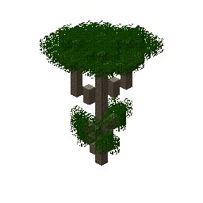

### biomeswevegone/aspen_tree4

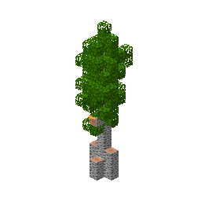

### biomeswevegone/baobab_tree1

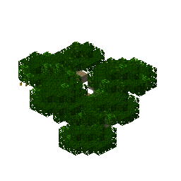

### biomeswevegone/base_spirit_tree3

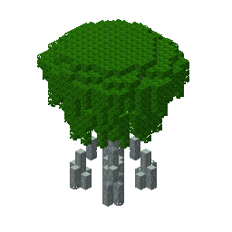

### biomeswevegone/blue_enchanted_sapling_tree2

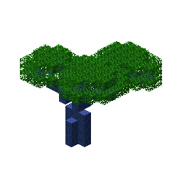

### biomeswevegone/brown_birch_tree3

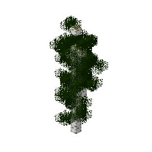

### biomeswevegone/brown_zelkova_tree1

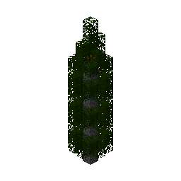

### biomeswevegone/cika_tree1

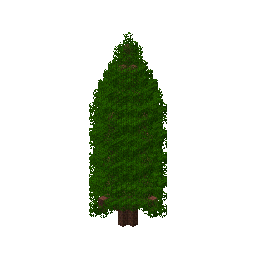

### biomeswevegone/conifer_tree5

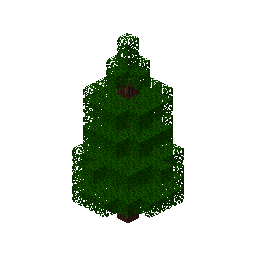

### biomeswevegone/cypress_tree1

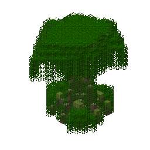

### biomeswevegone/ebony_bush1

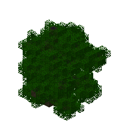

### biomeswevegone/flowering_ironwood_tree2

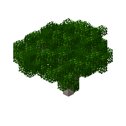

### biomeswevegone/green_enchanted_sapling_tree2

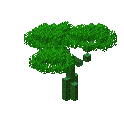

### biomeswevegone/holly_tree1

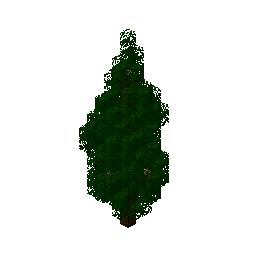

### biomeswevegone/huge_green_mushroom1

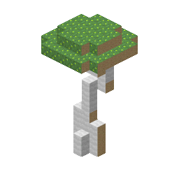

### biomeswevegone/huge_weeping_milkcap1

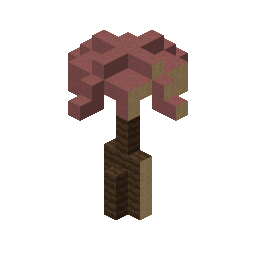

### biomeswevegone/huge_wood_blewit1

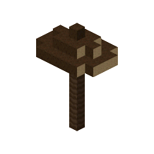

### biomeswevegone/indigo_jacaranda_tree1

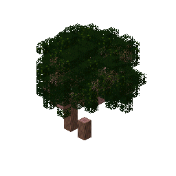

### biomeswevegone/large_brown_oak_tree1

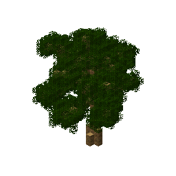

### biomeswevegone/large_orange_oak_tree1

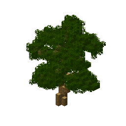

### biomeswevegone/large_red_oak_tree1

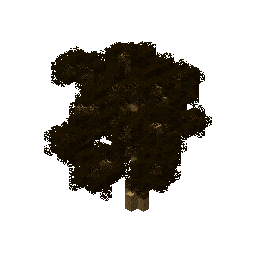

### biomeswevegone/mahogany_tree1

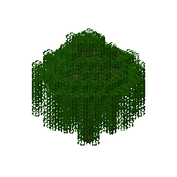

### biomeswevegone/maple_tree1

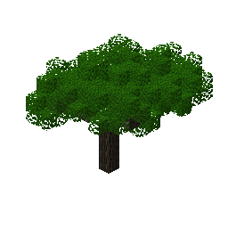

### biomeswevegone/orange_birch_tree3

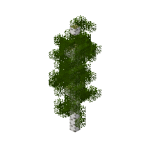

### biomeswevegone/orchard_tree1

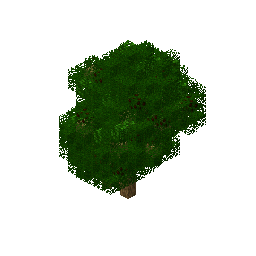

### biomeswevegone/palm_tree1

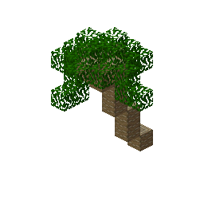

### biomeswevegone/palo_verde_tree1

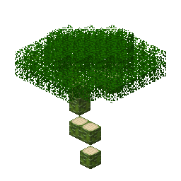

### biomeswevegone/pine_tree1

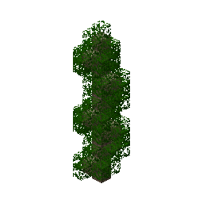

### biomeswevegone/rainbow_eucalyptus_tree1

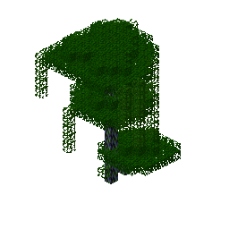

### biomeswevegone/red_birch_tree3

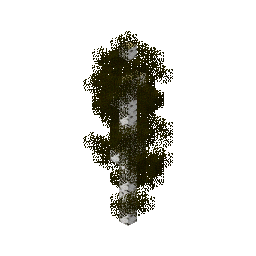

### biomeswevegone/red_maple_tree4

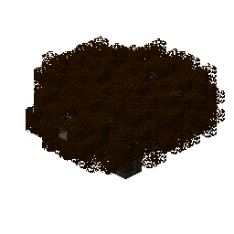

### biomeswevegone/redwood_tree1

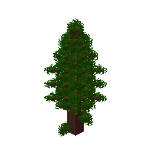

### biomeswevegone/silver_maple_tree4

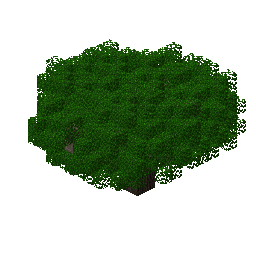

### biomeswevegone/skyris_tree1

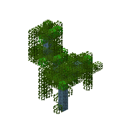

### biomeswevegone/spruce_blue_tree_medium2

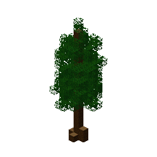

### biomeswevegone/spruce_orange_tree_medium2

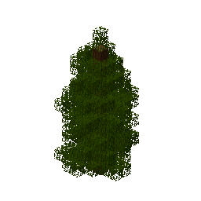

### biomeswevegone/spruce_red_tree_medium2

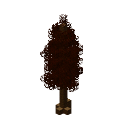

### biomeswevegone/spruce_yellow_tree_medium2

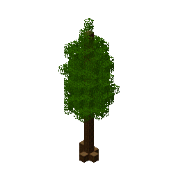

### biomeswevegone/white_mangrove_tree1

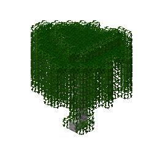

### biomeswevegone/white_sakura_tree3

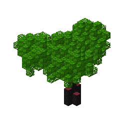

### biomeswevegone/willow_tree3

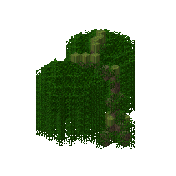

### biomeswevegone/witch_hazel3

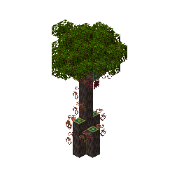

### biomeswevegone/yellow_birch_tree3

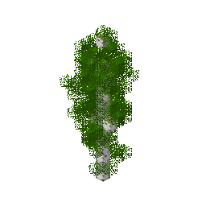

### biomeswevegone/yellow_sakura_tree3

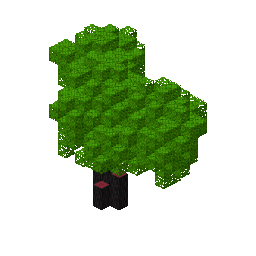

### biomeswevegone/yucca_tree1

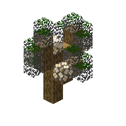

