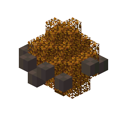
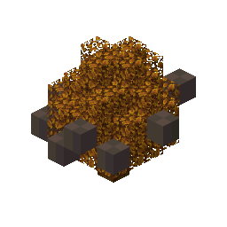
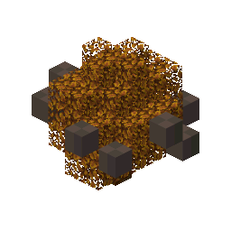
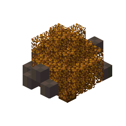
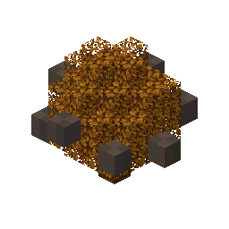
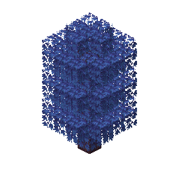
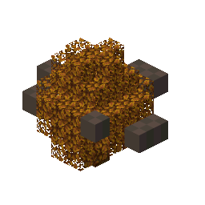
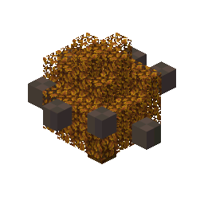

# cobblemon

8 bonsai tree preview(s), rendered by `create-tree-gif`.

### cobblemon/black_apricorn_tree

### cobblemon/blue_apricorn_tree

### cobblemon/green_apricorn_tree

### cobblemon/pink_apricorn_tree

### cobblemon/red_apricorn_tree

### cobblemon/saccharine_tree

### cobblemon/white_apricorn_tree

### cobblemon/yellow_apricorn_tree

