# minecraft

18 bonsai tree preview(s), rendered by `create-tree-gif`.

### minecraft/acacia

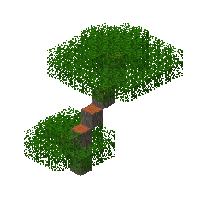

### minecraft/azalea_tree

### minecraft/birch

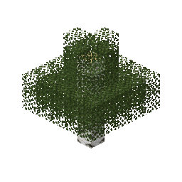

### minecraft/cherry

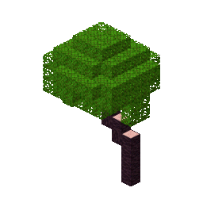

### minecraft/chorus_flower

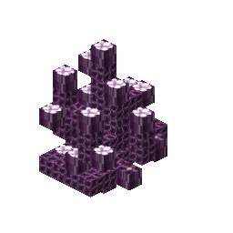

### minecraft/coral_claw

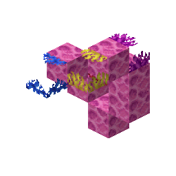

### minecraft/coral_mushroom

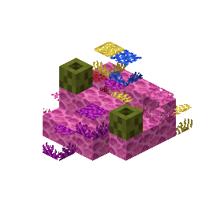

### minecraft/coral_tree

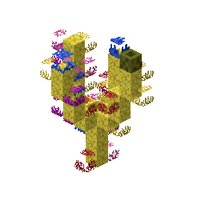

### minecraft/crimson_fungus_planted

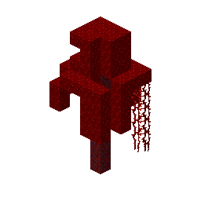

### minecraft/dark_oak

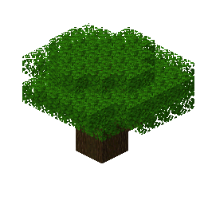

### minecraft/huge_brown_mushroom

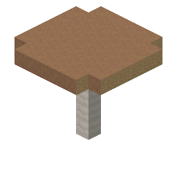

### minecraft/huge_red_mushroom

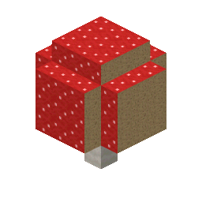

### minecraft/mangrove

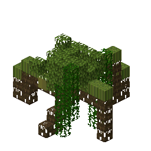

### minecraft/mega_jungle_tree

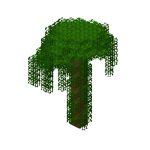

### minecraft/oak

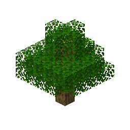

### minecraft/pale_oak_bonemeal

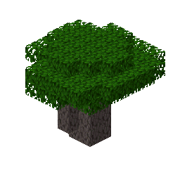

### minecraft/spruce

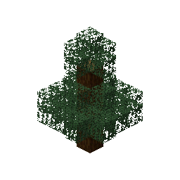

### minecraft/warped_fungus_planted

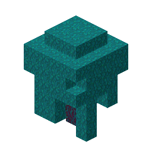

