# pamhc2trees

50 bonsai tree preview(s), rendered by `create-tree-gif`.

### pamhc2trees/acorn

### pamhc2trees/almond

### pamhc2trees/apple

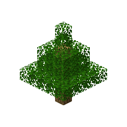

### pamhc2trees/apricot

### pamhc2trees/avocado

### pamhc2trees/banana

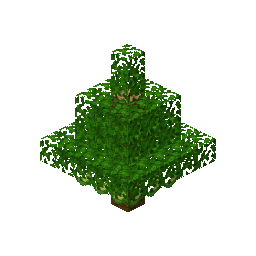

### pamhc2trees/breadfruit

### pamhc2trees/candlenut

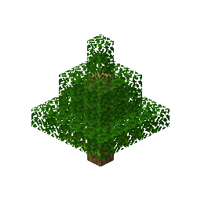

### pamhc2trees/cashew

### pamhc2trees/cherry

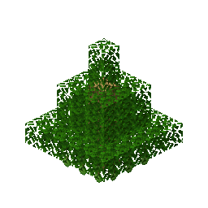

### pamhc2trees/chestnut

### pamhc2trees/cinnamon

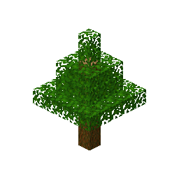

### pamhc2trees/coconut

### pamhc2trees/date

### pamhc2trees/dragonfruit

### pamhc2trees/durian

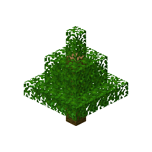

### pamhc2trees/fig

### pamhc2trees/gauva

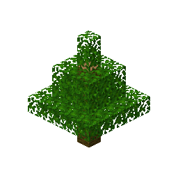

### pamhc2trees/gooseberry

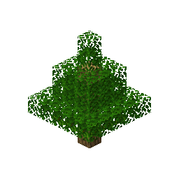

### pamhc2trees/grapefruit

### pamhc2trees/hazelnut

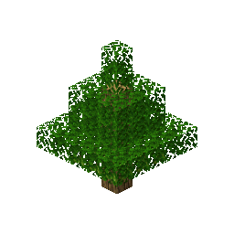

### pamhc2trees/jackfruit

### pamhc2trees/lemon

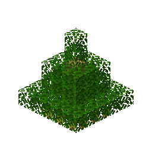

### pamhc2trees/lime

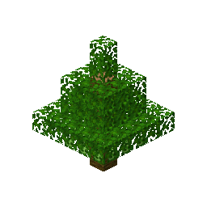

### pamhc2trees/lychee

### pamhc2trees/mango

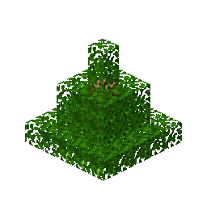

### pamhc2trees/maple

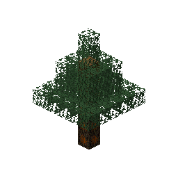

### pamhc2trees/nutmeg

### pamhc2trees/olive

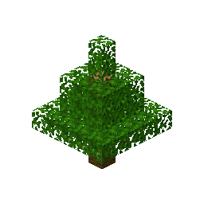

### pamhc2trees/orange

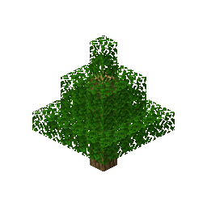

### pamhc2trees/papaya

### pamhc2trees/paperbark

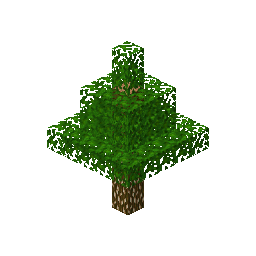

### pamhc2trees/passionfruit

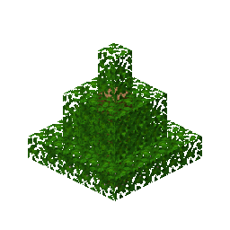

### pamhc2trees/pawpaw

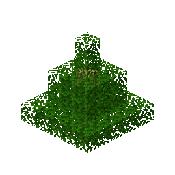

### pamhc2trees/peach

### pamhc2trees/pear

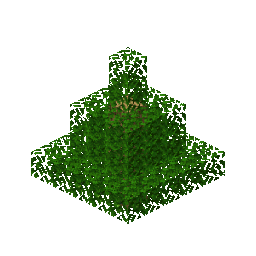

### pamhc2trees/pecan

### pamhc2trees/peppercorn

### pamhc2trees/persimmon

### pamhc2trees/pinenut

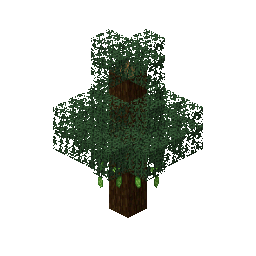

### pamhc2trees/pistachio

### pamhc2trees/plum

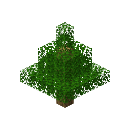

### pamhc2trees/pomegranate

### pamhc2trees/rambutan

### pamhc2trees/soursop

### pamhc2trees/spiderweb

### pamhc2trees/starfruit

### pamhc2trees/tamarind

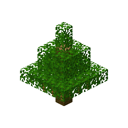

### pamhc2trees/vanillabean

### pamhc2trees/walnut

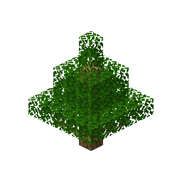

