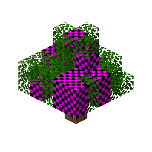
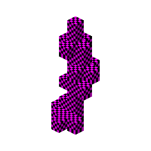
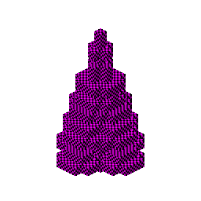
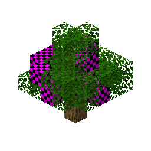
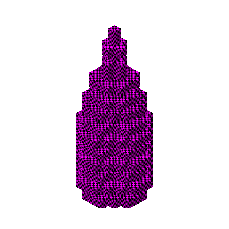
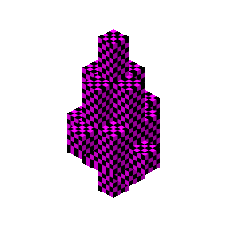

# regions_unexplored

35 bonsai tree preview(s), rendered by `create-tree-gif`.

### regions_unexplored/alpha_oak_tree

### regions_unexplored/apple_oak_tree

### regions_unexplored/ashen_tree

### regions_unexplored/bamboo_tree

### regions_unexplored/big_blackwood_tree

### regions_unexplored/blue_magnolia_tree

### regions_unexplored/brim_willow_tree

### regions_unexplored/cobalt_tree

### regions_unexplored/cypress_tree

### regions_unexplored/dead_pine_tree

### regions_unexplored/dead_tree

### regions_unexplored/enchanted_birch_tree

### regions_unexplored/eucalyptus_tree

### regions_unexplored/flowering_oak_tree

### regions_unexplored/giant_blue_bioshroom

### regions_unexplored/giant_green_bioshroom

### regions_unexplored/giant_pink_bioshroom

### regions_unexplored/giant_yellow_bioshroom

### regions_unexplored/larch_golden_tree

### regions_unexplored/larch_tree

### regions_unexplored/large_socotra_tree

### regions_unexplored/magnolia_tree

### regions_unexplored/maple_tree

### regions_unexplored/mauve_oak

### regions_unexplored/medium_joshua_tree

### regions_unexplored/orange_maple_tree

### regions_unexplored/palm_tree

### regions_unexplored/pine_tree

### regions_unexplored/pink_magnolia_tree

### regions_unexplored/red_maple_tree

### regions_unexplored/saguaro_cactus

### regions_unexplored/silver_birch_tree

### regions_unexplored/small_oak_tree

### regions_unexplored/white_magnolia_tree

### regions_unexplored/willow_tree

