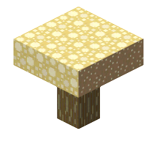
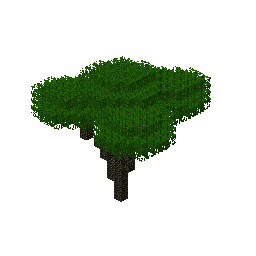
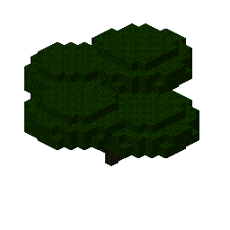
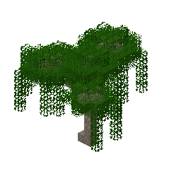
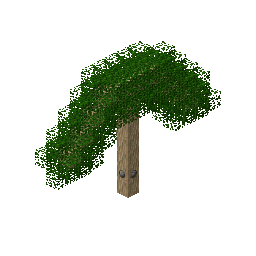
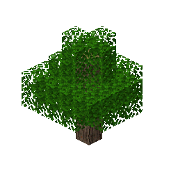
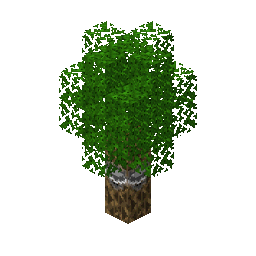
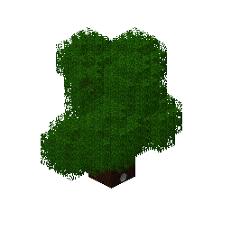
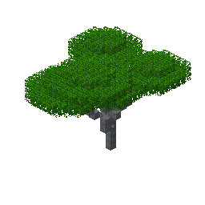
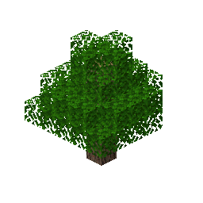

# twilightforest

10 bonsai tree preview(s), rendered by `create-tree-gif`.

### twilightforest/mushroom/big_mushgloom

### twilightforest/tree/canopy_tree

### twilightforest/tree/homegrown_darkwood_tree

### twilightforest/tree/mangrove_tree

### twilightforest/tree/mining_tree

### twilightforest/tree/rainbow_oak

### twilightforest/tree/sorting_tree

### twilightforest/tree/time_tree

### twilightforest/tree/transformation_tree

### twilightforest/tree/twilight_oak_tree

