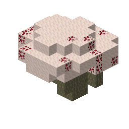
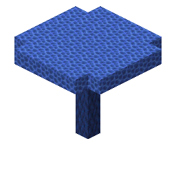
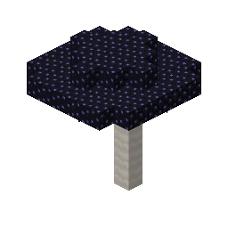
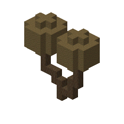
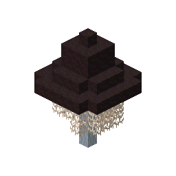
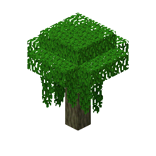
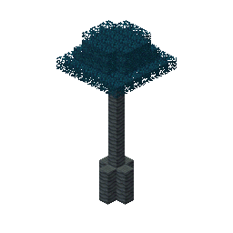
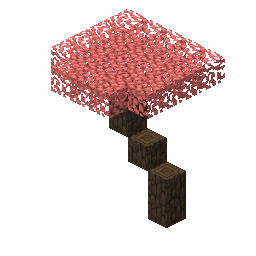

# undergarden

8 bonsai tree preview(s), rendered by `create-tree-gif`.

### undergarden/huge_blood_mushroom

### undergarden/huge_indigo_mushroom

### undergarden/huge_ink_mushroom

### undergarden/huge_puff_mushroom

### undergarden/huge_veil_mushroom

### undergarden/small_grongle_tree

### undergarden/smogstem_tree

### undergarden/wigglewood_tree

